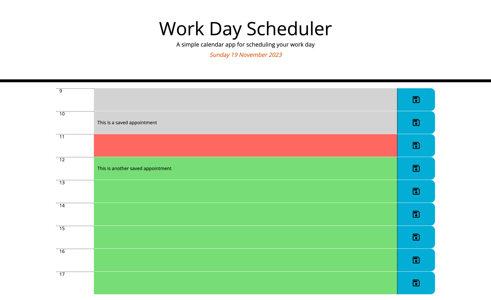

**Description**

This is a challenge to create a day planner which dynamically creates rows for each hour of the day, allows appointment information to be populated, and for that information to be saved in local storage so that it persists when the page is refreshed.  The requirements are -

The app should:

* Display the current day at the top of the calender when a user opens the planner.
 
* Present timeblocks for standard business hours when the user scrolls down.
 
* Color-code each timeblock based on past, present, and future when the timeblock is viewed.
 
* Allow a user to enter an event when they click a timeblock

* Save the event in local storage when the save button is clicked in that timeblock.

* Persist events between refreshes of a page

**Results**

https://danwhitlock.github.io/day-scheduler/

